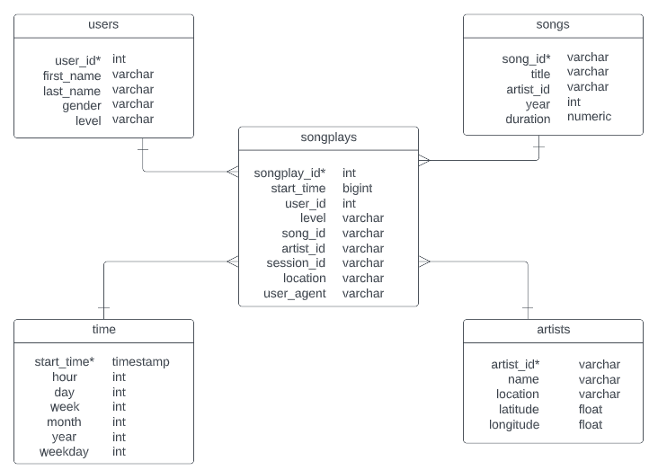

# Data Modeling with Postgres

## Project Description

Sparkify is a music streaming startup that currently stores its data in JSON format. They want to use a Postgres database to more quickly access that data to understand how users are using their service. A relational database is appropriate for the data structure and size of the dataset.

## Schema

I used a star schema to create a fact table (songplays) and 4 dimension tables (users, songs, artists, and time). My CREATE, INSERT, DROP, and SELECT SQL queries are defined in **sql_queries.py** and the file is run in the terminal. The related create_database, delete_tables, and create_tables functions are defined in **create_tables.py** and the file is run in the terminal.

## ETL Pipeline

The ETL pipeline requires first completing **etl.ipynb**, which defines the ETL processes used and tests this in **test.ipynb** to verify that these processes work correctly. Then, completing **etl.py** to read and process the entire dataset. Finally, this file, **README.md** contains the descriptive information regarding this project.